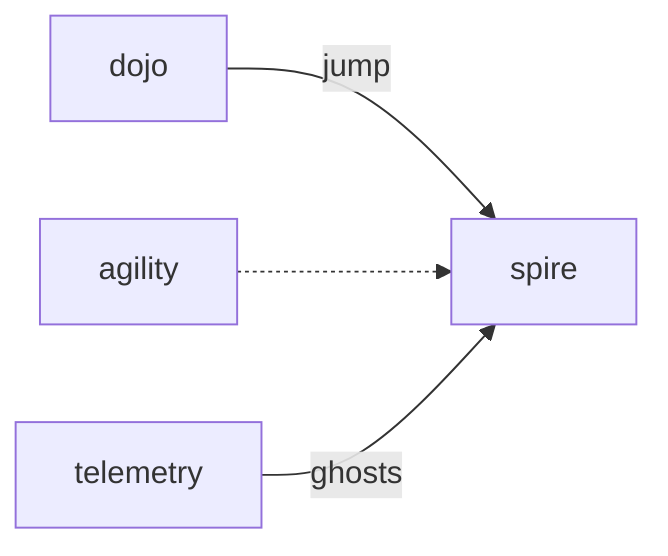

# Spire

**Pet Tower Climb** — Vertical climb that tests jump and endurance — daily height as a worldwide ghost race.

Part of [ComputerPets](https://github.com/RicheyWorks/computerpets). Map: [computerpets-ecosystem](https://github.com/RicheyWorks/computerpets-ecosystem).

| | |
| --- | --- |
| Status | Design scaffold — loop and engine frozen |
| License | MIT |
| Tokens | Minigames never mint or burn. Tired overlay, not a dead lineage. |
| First pet | [Meet Rui first](https://github.com/RicheyWorks/computerpets/blob/main/docs/START-HERE.md). This game is optional. |

## The loop

Agility is a horizontal course. Spire is up. Frogs shine. Heavy pandas do not, unless Dojo trained jump. Fair because stats are lived, not bought.

## Who plays

Vertical daily climb. Ghost race worldwide.

## What it is not

Pay-jump. Stats are lived in Dojo and overlay care.

## Genre and engine

- Genre: **Arcade jumper**
- Engine: **Phaser.js**
- Stack: TypeScript · Phaser 3 · vertical platforms · jump + endurance stats
- Default surface: `8080`

## Architecture



## How you play

1. Infinite (capped) tower, daily seed.
2. Miss = fall to last checkpoint.
3. Height submitted at death or quit.
4. Cosmetic flag at your max floor in Hearth.

## First slice

Build this and stop.

**Daily seed tower, Rui, checkpoint falls, height at quit.**

You know it works when: No pay-jump SKU. Lag: rewind 0.5s. Cheater ghosts stripped.

## Environment

Node 22

## Failure doctrine

Pay-jump items do not exist. Lag spike → rewind 0.5s. Ghost of a banned cheater stripped by Telemetry.

Canon rules that never yield:

- 210 living kinds. No illegal hybrids.
- Overlay pets can get tired, sick, or hide. Tokens are not burned by a minigame.
- Desktop walk stays the main quest. Closing Spire must leave Rui walking.

## Neighbors

- computerpets-agility
- computerpets-dojo
- computerpets-telemetry
- computerpets-quests

## Layout

```
computerpets-spire/
  README.md
  LICENSE
  docs/DESIGN.md
  src/                implementation lands here
```

## Run (Windows)

```powershell
cd app; npm install; npm run dev
```

Meet Rui first via the [flagship start-here](https://github.com/RicheyWorks/computerpets/blob/main/docs/START-HERE.md). This game is optional.

## Links

- Flagship: [RicheyWorks/computerpets](https://github.com/RicheyWorks/computerpets)
- This repo: [RicheyWorks/computerpets-spire](https://github.com/RicheyWorks/computerpets-spire)
- Map: [RicheyWorks/computerpets-ecosystem](https://github.com/RicheyWorks/computerpets-ecosystem)
- Design file: [docs/DESIGN.md](docs/DESIGN.md)

## License

MIT. See [LICENSE](LICENSE).

---

*Two hundred ten living kinds. Keep them so a line does not go quiet.*
